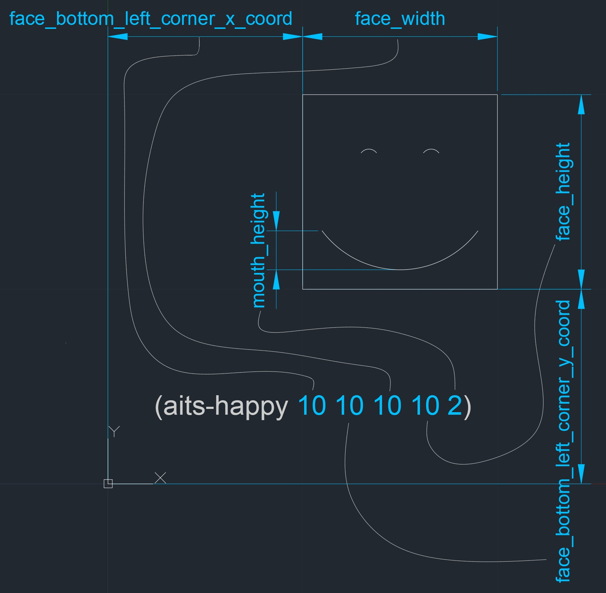
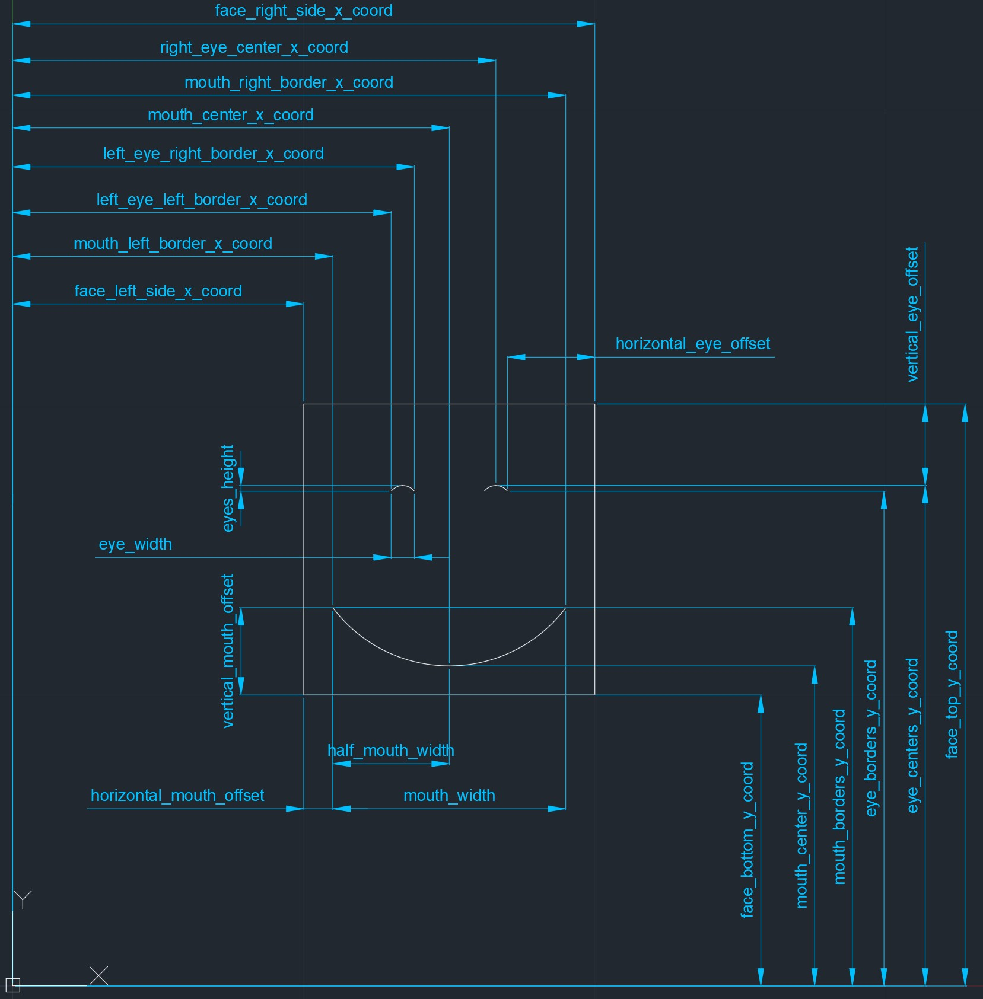
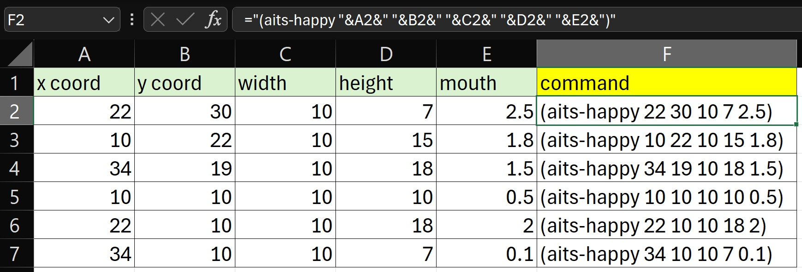

# AutoLISP-Smiles
AutoLISP script for drawing smiley faces in AutoCAD.

The original idea of this project was to write an introductory AutoLISP tutorial. I think understanding how to build a simple function that draws a face could be of help to someone starting to learn AutoLISP. I haven't finished writing the tutorial, but here I provide the code and some images that explain what the code does.

### Simple execution of the script
To check how the script works, drag and drop [smiles.lsp](smiles.lsp) into a new AutoCAD drawing, type into the command line `(aits-happy 10 10 10 10 2)`, and press enter. The script will draw a face as below:


### Arguments
From the previous section, you might have noticed the AutoLISP function receives five arguments. The image below explains what each argument represents. 



### Variables
If you open [smiles.lsp](smiles.lsp), you will see many variables used in the function. I have also prepared an image that explains most of those variables, please find it below. 



### Multiple executions
Using Excel it is possible to write the AutoLISP function easier, and then to produce a big amount of statements that then we copy and paste into AutoCAD. See the image below - the cell F2 contains the formula `="(aits-happy "&A2&" "&B2&" "&C2&" "&D2&" "&E2&")"`.



If we copy and paste the statements produced with Excel as shown before, we will produce six smiley faces as per the image below:


In case you want to test producing these faces without spending time building the Excel, you can copy the statements below and paste them in the command line of a new drawing:

```
(aits-happy 22 30 10 7 2.5)
(aits-happy 10 22 10 15 1.8)
(aits-happy 34 19 10 18 1.5)
(aits-happy 10 10 10 10 0.5)
(aits-happy 22 10 10 18 2)
(aits-happy 34 10 10 7 0.1)

```
	


